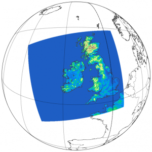

The Met Eireann ReAnalysis explorer
========================
In 2016, the Irish national meteorological service ([Met Eireann](https://www.met.ie/)) produced an [atmospheric reanalysis](https://en.wikipedia.org/wiki/Atmospheric_reanalysis): the Met Eireann ReAnalysis, or [MERA](https://www.met.ie/climate/available-data/mera).
The main purpose of this repository is provide tools to browse and manipulate the data from this reanalysis.




Installation
------------

We recommend using isolate Python environment to prevent any disruption with exisitng installation.
The chosen solution is to use [virtual environments](https://docs.python.org/3/library/venv.html).
The installation procedure starts from scratch, please skip any step you have already done.

### 1. Set up your virtual environments

As virtual environment can be reach relatively large sizes (with deep learning library, ~5GB per venv), we recommend to store them in a large enough file system.
Typically, $HOME directories may be too small.
We store the virtual environments in the variable `VENVROOT`, here set to `/data/trieutord/venvs`.
Please adjust the path to your account and execute the following commands;

```
export VENVROOT=/data/trieutord/venvs
mkdir $VENVROOT
```

### 2. Create a new environment and update pip

After restarting your shell, you will be able to create a new environment with Python 3.11 with the following commands. We suggest `merax` (MERA eXplorer) as the environment name.
```
python3 -m venv $VENVROOT/merax
source $VENVROOT/merax/bin/activate
python -m pip install --upgrade pip
deactivate
```

### 3. Install the other dependencies and this package with pip

In the directory containing the `pyproject.toml`, run
```
source $VENVROOT/merax/bin/activate
pip install -e .
```

### Activate/deactivate the environment

To activate the environment, use
```
source $VENVROOT/merax/bin/activate
```
The prompt should now display `(merax)` and `which python` must give the path `$VENVROOT/merax/bin/python`. The package is only available when the environment is activated.


To deactivate the environment, use
```
deactivate
```
The prompt should be back to normal and the Python interpreter is system default.


### Check the installation

The environment must be activated each time you want to use the package.
To check the installation:
```
python tests/import_tests.py
```


Usage
------

### Know if the data you want is available in MERA

  1. Edit the YAML file at `mera_explorer/data/mydata.yaml` to list all the variables you want
  2. Launch `python scripts/is_my_data_there.py [--fs=FILESYSTEM] [--vars=YAMLFILE]`


### Transferring the data

Once you have identified where is the data your are looking for, you can use the script `copy_from_reaext.py` to get them.
At the moment, the transfer works only from the reaext* drives.
The script is intended to run on Reaserve and the drive mounted to the host given by
```
head -2 filesystems/merafiles_reaext0[3-8].txt
```
For example, with reaext03:
```
(merax) [trieutord@REAServe2 mera-explorer]$ head -2 filesystems/merafiles_reaext03.txt
#!HOSTNAME=realin15
#!MERAROOT=/run/media/trieutord/reaext03
```

Please edit these lines if they are not correct.
Then the transfer can be launched.
For example, here is the command get all the variables needed in Neural-LAM that are present in reaext03 from the years 1981 to 2017 (included):
```
python copy_from_reaext.py --fs=reaext03 --vars=neurallam.yaml --ruser=trieutord --lrootdir=/data/trieutord/MERA/grib-from-reaext --rdates=1981-01_2017-12 --verbose
```

### Convert the data into a different format

Not implemented yet.


More infos
----------

### About

For the time being (Jan. 2024) MERA data are scattered in several places: part of it (the most commonly used variables) are stored in HDD read manually by the staff at Met Eireann HQ, another part of it (the less commonly used variables) are stored in the ECFS facility retrieved and read with ECFS tools.
The current code only browse the file systems of the HDD (exported in the `reaext/*.txt`) and the list of variables provided by the document describing MERA.
To get access to the data (after you checked if it is there with this code), ask Eoin Whelan (eoin.whelan@met.ie) or Emily Gleeson (emily.gleeson@met.ie).


### License:

All rights reserved. Met Éireann 2024.
